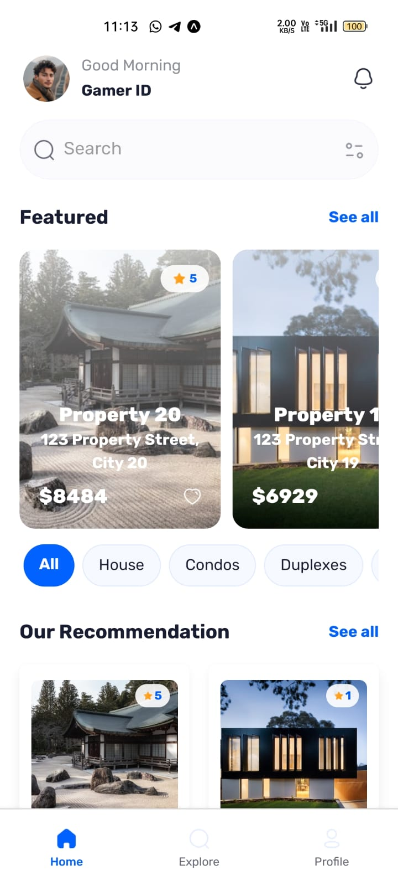
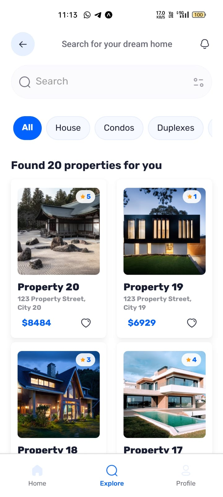

# Restate

A minimal, modern real estate mobile app built with React Native, Expo Router, and NativeWind.

<p align="center">
  
  
  
</p>

---

## Features

- Browse, search, and filter property listings
- View property details, agent info, and reviews
- Clean, utility-first UI with NativeWind (Tailwind CSS for React Native)
- Fast, responsive, and easy to use

---

## Getting Started

1. **Clone the repository:**
   ```bash
   git clone https://github.com/neevan0842/real_estate_mobile.git
   cd real_estate_mobile
   ```
2. **Install dependencies:**
   ```bash
   npm install
   ```
3. **Set up environment variables:**
   Copy `.env.sample` to `.env` and fill in your Appwrite credentials:
   ```bash
   cp .env.sample .env
   # Edit .env with your values
   ```
   Required variables:
   - `EXPO_PUBLIC_APPWRITE_ENDPOINT`
   - `EXPO_PUBLIC_APPWRITE_PROJECT_ID`
   - `EXPO_PUBLIC_APPWRITE_PLATFORM`
   - `EXPO_PUBLIC_APPWRITE_DATABASE_ID`
   - `EXPO_PUBLIC_APPWRITE_GALLERIES_COLLECTION_ID`
   - `EXPO_PUBLIC_APPWRITE_REVIEWS_COLLECTION_ID`
   - `EXPO_PUBLIC_APPWRITE_AGENTS_COLLECTION_ID`
   - `EXPO_PUBLIC_APPWRITE_PROPERTIES_COLLECTION_ID`
4. **Start the app:**
   ```bash
   npx expo start
   ```
   Open in Expo Go, Android emulator, or iOS simulator.

---

## Folder Structure

- `app/` — App screens and layouts
- `components/` — UI components
- `constants/` — Static data and assets
- `lib/` — Appwrite and utility logic
- `assets/` — Fonts and images
- `static/` — App screenshots

---

## Credits

- Built with [React Native](https://reactnative.dev/), [Expo](https://expo.dev/), [NativeWind](https://www.nativewind.dev/)
- Images & icons from [assets](./assets/) and [static](./static/)

---

<p align="center">
  <a href="https://github.com/neevan0842/real_estate_mobile">GitHub Repo</a>
</p>
